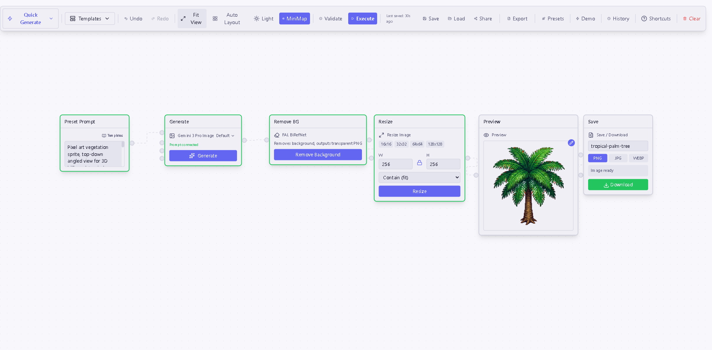
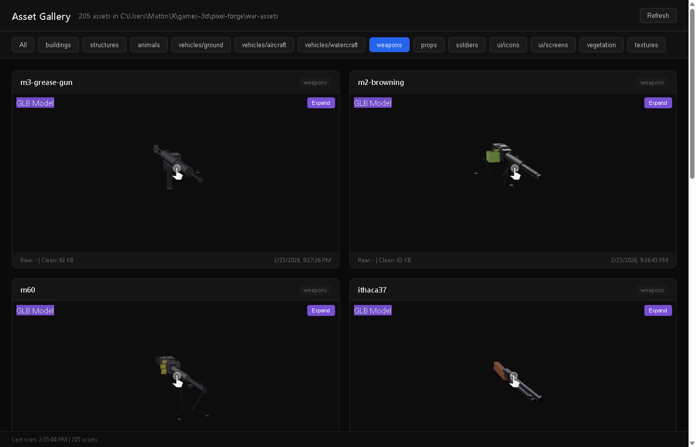
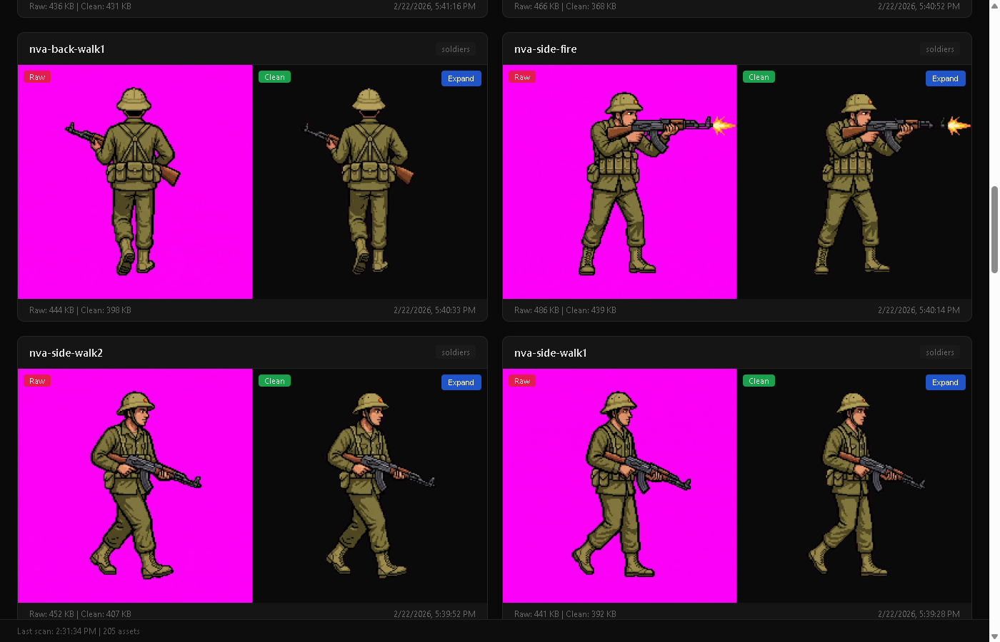
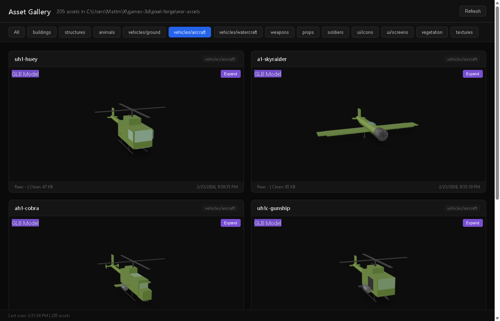
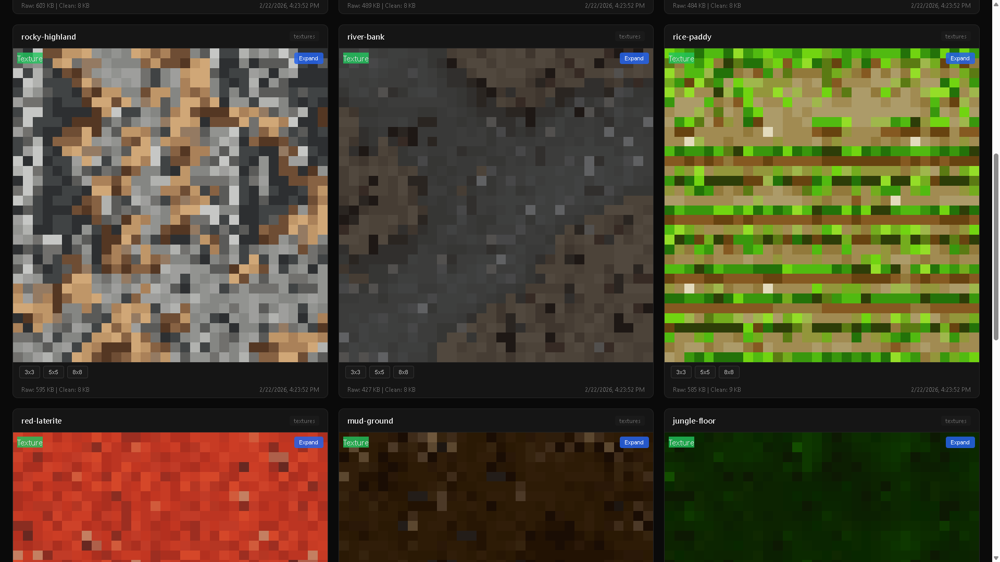

<p align="center">
  <h1 align="center">Pixel Forge</h1>
  <p align="center">
    <b>One substrate. Four transports. Zero Blender.</b><br/>
    AI-powered game asset pipelines you drive from the browser, your shell,
    your editor's agent, or an HTTP call.
  </p>
</p>

<p align="center">
  <a href="https://github.com/matthew-kissinger/pixel-forge/releases"></a>
  <a href="LICENSE"></a>
  <a href="https://github.com/matthew-kissinger/pixel-forge/actions"></a>
  
  
  
  
</p>

---

## What is it?

Pixel Forge turns **text prompts** into **game-ready assets** — 2D sprites with clean transparency, seamless pixel-art textures, and 3D GLB models — through pipelines you can drive four different ways:

- **[Visual node editor](#1--visual-editor)** — drag nodes, wire them up, hit run
- **[`pixelforge` CLI](#2--cli-pixelforge)** — one command, one asset, scriptable
- **[MCP server](#3--mcp-server)** — drop the tools into Claude Code / Cursor / any MCP client and let an agent drive
- **[HTTP API](#4--http-api)** — Hono server for your own frontends or bots

All four wrap **one library**: [`@pixel-forge/core`](packages/core/). No duplication, no drift.

> **Why this is different:** the 3D path is LLM-authored, not image-to-mesh. Claude writes small TypeScript programs against a library of **48 Three.js primitives** (CSG booleans, shape-aware UV unwraps, parametric gears + blades, PBR, instancing) and they render straight to GLB via `@gltf-transform/core`. No Blender, no photogrammetry, no hallucinated meshes. See [docs/kiln-vision.md](docs/kiln-vision.md).

<!-- SCREENSHOT-REFRESH: the screenshots below are from the pre-Round-3 build.
     Plan to regenerate the full set (editor, gallery, soldiers, vegetation,
     vehicles, textures, Kiln validation grid) once the user approves the
     shot list. See docs/screenshot-refresh.md. -->

### Gallery

| | |
|---|---|
| **Visual editor** — node-based asset pipelines |  |
| **Asset gallery** — compare, inspect, export |  |
| **2D sprites** — faction soldiers, 32-bit pixel art |  |
| **3D GLBs** — LLM-authored via Kiln primitives |  |
| **Tileable terrain** — FLUX 2 + Seamless LoRA |  |

> 📸 **These screenshots are due for a refresh** — current pipelines produce better results than what's shown. Tracking in [docs/screenshot-refresh.md](docs/screenshot-refresh.md). Contributions welcome.

---

## What's in the box

| | |
|---|---:|
| Kiln primitives (CSG, UV, gears, PBR, instancing, …) | **48** in 12 categories |
| Validation GLBs (all audited clean under strict back-face culling) | **12 / 12** |
| Node types in the visual editor | **30** (28 lazy-loaded) |
| Test coverage — core · server · client · cli · mcp | **~2,100 expect()** calls |
| Supported AI providers | Gemini, FAL, Claude, OpenAI |
| Packages in the monorepo | 5 (core, client, server, cli, mcp) + shared |

---

## The four transports

### 1 · Visual editor

```bash
bun install
bun run dev:server    # :3000 — API
bun run dev:client    # :5173 — editor
```

Open `http://localhost:5173` to build pipelines; `http://localhost:3000/gallery` to browse output. Every node has a retry button, per-node timeouts, and an error boundary. Undo/redo and auto-save to localStorage are on by default.

### 2 · CLI (`pixelforge`)

```bash
cd packages/cli && bun link

pixelforge gen sprite  --prompt "m16 rifle, side view" --bg magenta --out m16.png
pixelforge gen texture --description "jungle moss" --size 512 --out moss.png
pixelforge gen glb     --prompt "guard tower" --category structure --out tower.glb

pixelforge inspect glb ./tower.glb
pixelforge kiln list-primitives
pixelforge kiln bake-imposter ./tree.glb --out ./tree.png --angles 16
pixelforge kiln lod ./char.glb --out-dir ./lods --ratios 1.0,0.5,0.25,0.1
pixelforge kiln ingest-fbx ./prop.fbx --out ./prop.glb
pixelforge providers list
```

Every command accepts `--json` for machine-readable stdout. Errors print `code` + `fixHint` from the core's `PixelForgeError` taxonomy and exit non-zero. Full surface: [packages/cli/README.md](packages/cli/README.md).

### 3 · MCP server

Drop it into any MCP client (Claude Code, Cursor, Zed, your own) and an agent can generate assets without you pasting curl commands:

```bash
claude mcp add pixelforge --stdio bun packages/mcp/src/index.ts
```

Tools auto-discovered by the client:

- `pixelforge_gen_{sprite, icon, texture, glb, soldier_set}`
- `pixelforge_kiln_{inspect, validate, refactor, list_primitives, bake_imposter, lod, pack_atlas, ingest_fbx, retex, cleanup_photogrammetry}`
- `pixelforge_providers_capabilities`

Binary outputs default to a tmp file path (lets the agent reason about the asset without blowing up context); pass `inline: true` for base64 or `outPath: "..."` for an explicit destination. Full surface: [packages/mcp/README.md](packages/mcp/README.md).

### 4 · HTTP API

```bash
bun run dev:server      # Hono on :3000
curl -sX POST localhost:3000/api/kiln/generate \
  -H 'Content-Type: application/json' \
  -d '{"prompt":"guard tower","category":"structure"}'
```

Routes mirror the CLI surface. Validation via Zod, responses typed, same error taxonomy. See [packages/server/README.md](packages/server/README.md).

---

## Pipelines at a glance

| Pipeline | AI service | Input | Output |
|---|---|---|---|
| **2D sprites** | Gemini 3.1 Flash Image | Prompt + style preset | Transparent PNG |
| **Background cleanup** | FAL BiRefNet + chroma key | Any image | Clean transparency |
| **Tileable textures** | FAL FLUX 2 + Seamless LoRA | Terrain description | Seamless pixel-art tile |
| **3D models (Kiln)** | Anthropic Claude → Three.js → GLB | Object description | GLB via primitives, no Blender |
| **Image → 3D** | FAL Meshy (optional) | Reference image | Textured GLB |

**Battle-tested domain knowledge** ships in the repo — [docs/asset-reference.md](docs/asset-reference.md) + the CLAUDE.md pipelines document things like *"never use `#FF0000` background, it bleeds into greens and skin tones"*, *"don't run BiRefNet on colored emblems — use direct green chroma key"*, *"side-walk sprites need a visual pose reference, Gemini ignores 'leg forward' in text"*. This is the kind of thing you usually rediscover painfully; we wrote it down.

---

## Kiln — the LLM-to-GLB path

Most AI-to-3D tools give you a black box (image → mesh). Kiln gives you a **primitive library** and lets Claude compose it:

```ts
// What the LLM writes
const meta = { name: 'GuardTower', category: 'structure' };

async function build() {
  const root = createRoot('Tower');
  const stone = lambertMaterial(0x8a7a6a);

  // Hollow keep + arrow slits, all in one CSG pass.
  const outer = new THREE.Mesh(cylinderGeo(1, 1, 3, 16), stone);
  const hollow = new THREE.Mesh(cylinderGeo(0.85, 0.85, 3.2, 16), stone);
  const door = new THREE.Mesh(boxGeo(0.45, 0.9, 0.4), stone);
  door.position.set(0, -1.05, 0.9);

  const keep = await boolDiff('Keep', outer, hollow, door, { smooth: false });
  keep.position.y = 1.7;
  root.add(keep);

  // Battlements + conical roof
  const merlon0 = createPart('Merlon0', boxGeo(0.2, 0.4, 0.3), stone,
    { position: [1, 3.4, 0], parent: root });
  arrayRadial('Merlon', merlon0, 12, 'y', root);
  createPart('Roof', coneGeo(0.9, 1.1, 16), lambertMaterial(0x6b3a2a),
    { position: [0, 4.15, 0], parent: root });

  return root;
}
```

What you get for free:

- **Headless GLB export** via `@gltf-transform/core` (no browser APIs)
- **CSG booleans** (manifold-3d WASM) with `{ smooth }` control
- **Shape-aware UV unwraps** that preserve directional UVs for box / cylinder / plane
- **Parametric primitives** — `gearGeo({ teeth, rootRadius, tipRadius, boreRadius, height })`, `bladeGeo({ length, baseWidth, thickness, tipLength, edgeBevel })`
- **Offline 6-view grid audit** (`bun run audit:glb`) that renders every GLB under **strict back-face culling** — catches winding bugs that `<model-viewer>` hides because it renders double-sided
- **Primitive usage counter** — every generation ships `render.meta.primitiveUsage` so you can see which helpers your agents actually reach for

Full cycle history: [docs/kiln-vision.md](docs/kiln-vision.md). Round-specific handoffs: [kiln-round-1.md](docs/kiln-round-1.md) · [kiln-round-3.md](docs/kiln-round-3.md).

---

## Quick start

```bash
# Prereqs: Bun (https://bun.sh), Node 22+
bun install

# Copy API-key template and paste your keys
cp .env.example .env.local
cp .env.example packages/server/.env.local

# Run
bun run dev:server    # :3000 API
bun run dev:client    # :5173 editor
```

### API keys

| Service | Required | Powers | Get a key |
|---|:---:|---|---|
| Google Gemini | ✅ | 2D sprite generation | [Google AI Studio](https://aistudio.google.com/apikey) |
| FAL AI | ✅ | Bg removal, textures, 3D | [FAL dashboard](https://fal.ai/dashboard/keys) |
| Anthropic | optional | Kiln 3D composition | [Anthropic console](https://console.anthropic.com/settings/keys) |
| OpenAI | optional | gpt-image fallback | [OpenAI platform](https://platform.openai.com/api-keys) |

Bun auto-loads `.env.local` from the repo root and `packages/server/`. Multi-project users can point at a shared `~/.config/mk-agent/env` and fan it out with `bun scripts/pull-keys.ts`.

**Before committing:** run `bash scripts/secret-scan.sh` or install it as a pre-commit hook:

```bash
cp scripts/secret-scan.sh .git/hooks/pre-commit && chmod +x .git/hooks/pre-commit
```

Scans staged changes for Gemini / Anthropic / OpenAI / FAL / GitHub / Slack / AWS key patterns.

---

## Project layout

```
pixel-forge/
  packages/
    core/     # @pixel-forge/core — headless substrate (kiln/, image/, providers/)
    client/   # React 19 + React Flow 12 + Zustand + Tailwind
    server/   # Hono API + Zod validation
    cli/      # citty CLI → core
    mcp/      # stdio MCP server → core
    shared/   # cross-adapter types only
  scripts/    # Recipe scripts + visual-audit.ts + secret-scan.sh
  docs/       # Prompt templates, cycle logs, wave reports
  e2e/        # Playwright smoke + mobile + workflow
  .claude/    # Skill definitions for Claude agents
```

## Commands

```bash
# Development
bun run dev:client      # editor   :5173
bun run dev:server      # API      :3000
bun run dev             # both, concurrently

# Quality
bun run typecheck       # tsc --noEmit across packages
bun run lint            # ESLint across packages
bun run build           # production build

# Tests (run per-package, not from root)
cd packages/core   && KILN_SPIKE_LIVE=0 IMAGE_PROVIDERS_LIVE=0 bun test   # 284 pass + 6 skip
cd packages/server && bun test                                            # 114 pass
cd packages/client && bunx vitest run                                     # ~1900 pass
cd packages/cli    && bun test                                            # 16 pass
cd packages/mcp    && bun test                                            # 7 pass
bun run test:e2e                                                          # Playwright

# QA for Kiln output
bun run audit:glb                             # 6-view grid PNG per validation GLB
bun run audit:glb gear.glb sword.glb          # subset
bun run audit:review                          # open single-page HTML review
```

---

## Architecture

```
┌──── visual editor ────┐ ┌── pixelforge CLI ──┐ ┌── MCP server ──┐ ┌── HTTP API ──┐
│    React Flow DAG     │ │      citty         │ │      stdio     │ │     Hono     │
└────────────┬──────────┘ └──────────┬─────────┘ └────────┬───────┘ └───────┬──────┘
             │                       │                    │                 │
             └───────────────────────┴──────────┬─────────┴─────────────────┘
                                                │
                                    ┌───────────▼──────────┐
                                    │  @pixel-forge/core   │
                                    │   kiln / image /     │
                                    │    providers /       │
                                    │      pipelines       │
                                    └───────────┬──────────┘
                                                │
                        ┌───────────────────────┼──────────────────────┐
                        │                       │                      │
                   Gemini / OpenAI           FAL (BiRefNet,        Anthropic Claude
                    (2D sprites)         FLUX 2, Meshy, LoRA)      (Kiln primitives)
```

Editor runs a **dataflow execution model**: nodes define ops, edges form a DAG, the executor topo-sorts and runs independent nodes in parallel waves. 28 complex node components are lazy-loaded; Three.js (~380 KB gzip) only loads when a 3D node is used. Main bundle is **~103 KB gzip**.

Agent adapters (CLI, MCP, HTTP) are thin — they translate `(args) → core function` and don't re-implement generation. Add a new pipeline in core, all four transports inherit it.

---

## Roadmap

- **In progress (Round 3 landed 2026-04-22):** three.js 0.184, validation-asset polish (door / vending / tower), agent-usage counter on `render.meta.primitiveUsage` — see [docs/kiln-round-3.md](docs/kiln-round-3.md)
- **Next (Round 4):** `planeUnwrapSingle`, `cylinderUnwrap({ capMode })`, gallery UI surface for `primitiveUsage`, `pickProviderFor` on public namespace
- **Later:** Wave 3C (FAL-generated textures for validation assets), Wave 3D (projection bake), Wave 4 (image-to-3D integration), Wave 2.5b gallery rearchitect

Fresh screenshots + a demo video are on the list too — see [docs/screenshot-refresh.md](docs/screenshot-refresh.md).

---

## Contributing

We welcome PRs, issues, and ideas. A few low-friction ways to help:

- **New primitive** in `packages/core/src/kiln/` — add a unit test alongside, run `bun run audit:glb` on a validation GLB that uses it. See the [winding-bug lesson](docs/kiln-round-3.md#winding-bug-lesson-for-any-new-primitive) before shipping geometry.
- **New pipeline** — add it in `@pixel-forge/core`, the CLI / MCP / API surface inherits it automatically.
- **Screenshots + demos** — we're rebuilding the gallery. See [docs/screenshot-refresh.md](docs/screenshot-refresh.md) for the shot list.
- **Bugs / rough edges** — open an issue; include `bun run typecheck` + per-package test output so we can reproduce.

### Local development loop

```bash
# 1. Fork + branch
git checkout -b feature/my-thing

# 2. Write code + tests
#    - new primitives live alongside their test in packages/core/src/kiln/__tests__/
#    - touched validation GLB? regen + re-audit:
bun scripts/validate-wave2a.ts && bun run audit:glb

# 3. Gate must stay green:
bun run typecheck
cd packages/core && KILN_SPIKE_LIVE=0 IMAGE_PROVIDERS_LIVE=0 bun test

# 4. Open a PR
```

**House rules:**

- No emojis in code or docs unless explicitly themed.
- Hyphens over em dashes. Measure, don't assume.
- LLM-touched pipelines ship with a recipe test that exercises the full flow at least once.
- Don't bypass the secret-scan hook.

More in [AGENTS.md](AGENTS.md) (the canonical agent-facing reference — architecture, public API, and pipeline contracts).

---

## Tech stack

| Layer | Tech |
|---|---|
| **Frontend** | React 19 · Vite 7 · React Flow 12 · Zustand · Tailwind CSS |
| **Backend** | Hono · Bun |
| **3D** | Three.js 0.184 · @gltf-transform/core · manifold-3d (CSG) · xatlas (UV) |
| **AI** | Gemini 3.1 Flash Image · FAL (BiRefNet, FLUX 2, Meshy) · Claude Opus 4.7 · OpenAI |
| **Testing** | Vitest · bun:test · Playwright |
| **CI** | GitHub Actions |

---

## License

[MIT](LICENSE) — Matthew Kissinger. Use it, fork it, ship things with it.
