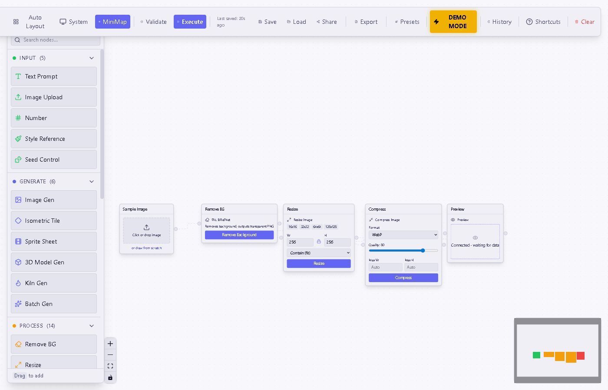
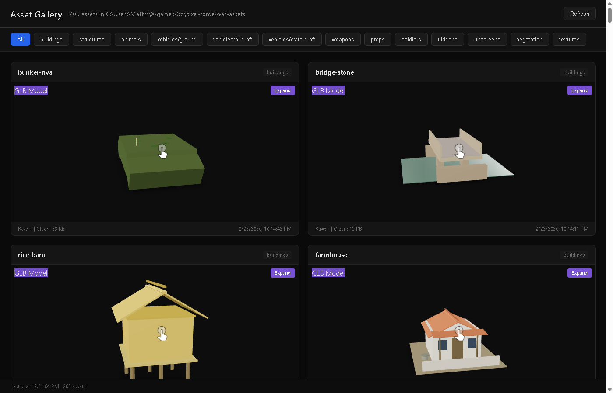
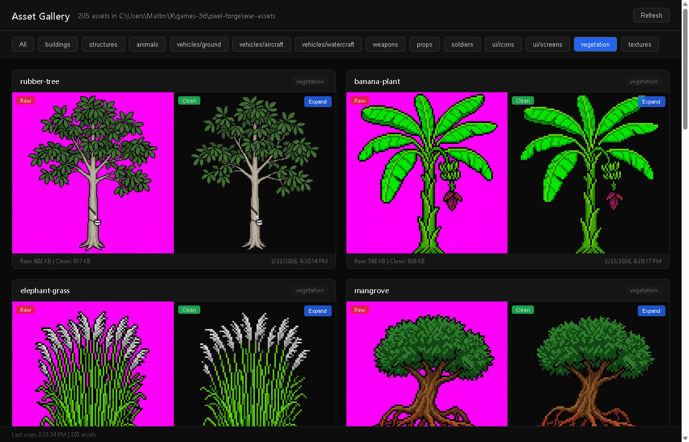
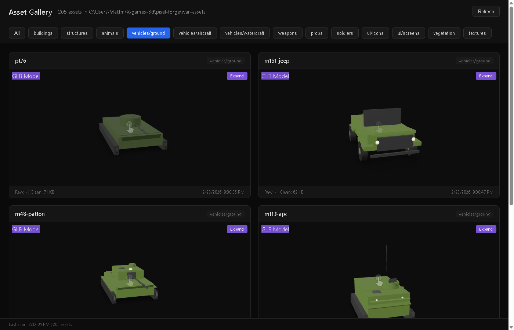

<p align="center">
  <h1 align="center">Pixel Forge</h1>
  <p align="center">
    Node-based AI game asset generator.<br/>
    Visual pipelines for 2D sprites, tileable textures, and 3D models.
  </p>
</p>

<p align="center">
  <a href="https://github.com/matthew-kissinger/pixel-forge/releases"></a>
  <a href="LICENSE"></a>
  <a href="https://github.com/matthew-kissinger/pixel-forge/actions"></a>
  
  
  
</p>

---

## Overview

Pixel Forge is a visual node editor for generating game-ready assets with AI. Drag, connect, and execute pipelines that produce sprites, textures, and 3D models - all from text prompts.

### Node Editor

Build asset pipelines by connecting nodes. Each node handles one step - generation, processing, or export.



### Asset Gallery

Browse, compare, and review generated assets. Raw vs clean comparison for sprites, tiled preview for textures, interactive 3D viewer for GLB models.



### Generated Assets

All assets below were generated entirely by AI through Pixel Forge pipelines.

<table>
<tr>
<td width="50%">

**2D Sprites** - Pixel art characters with automatic background removal


</td>
<td width="50%">

**Vegetation** - Billboard sprites with magenta chroma key cleanup


</td>
</tr>
<tr>
<td width="50%">

**3D Vehicles** - GLB models built from Three.js primitives via Claude


</td>
<td width="50%">

**Ground Vehicles** - Tanks, APCs, jeeps, trucks


</td>
</tr>
<tr>
<td colspan="2">

**Tileable Textures** - Seamless pixel-art terrain tiles via FLUX 2 + LoRA


</td>
</tr>
</table>

---

### Pipelines

| Pipeline | AI Service | Input | Output |
|----------|-----------|-------|--------|
| **2D Sprites** | Gemini (nano-banana-pro) | Text prompt + style preset | Transparent PNG sprites |
| **Tileable Textures** | FLUX 2 + Seamless LoRA (FAL) | Terrain description | Seamless pixel-art tiles |
| **3D Models** | Claude (Anthropic) | Object description | GLB models via Three.js primitives |
| **Background Removal** | BiRefNet (FAL) | Any image | Clean transparency |

### Key Features

- **30 node types** - image gen, bg removal, 3D gen, canvas ops, batch processing, analysis, export
- **Parallel execution** - topological sort with wave-based parallelism
- **Resilient** - per-node timeouts, retry with backoff, error boundaries on every node
- **Fast** - lazy-loaded nodes, ~103KB gzip main bundle, Three.js loaded on demand
- **Recoverable** - undo/redo snapshots, auto-save to localStorage, recovery banner
- **CLI + UI** - visual editor or command-line batch scripts
- **Agent-friendly** - documented API for AI agent workflows (see [`AGENTS.md`](AGENTS.md))

## Quick Start

```bash
# Prerequisites: Bun (https://bun.sh), Node 22+
bun install

# Configure API keys
cp .env.example packages/server/.env.local
# Edit packages/server/.env.local with your keys (see API Keys below)

# Start
bun run dev:server    # API server on :3000
bun run dev:client    # Editor UI on :5173
```

Open http://localhost:5173 for the visual editor, or http://localhost:3000/gallery to browse generated assets.

## API Keys

| Service | Required | What It Powers | Get a Key |
|---------|:--------:|----------------|-----------|
| Google Gemini | Yes | 2D sprite generation | [Google AI Studio](https://aistudio.google.com/apikey) |
| FAL AI | Yes | Background removal, texture gen, 3D gen | [FAL Dashboard](https://fal.ai/dashboard/keys) |
| Anthropic | Optional | 3D primitive composition (Kiln) | [Anthropic Console](https://console.anthropic.com/settings/keys) |

## Project Structure

```
pixel-forge/
  packages/
    client/       # React 19 + React Flow 12 + Zustand + Tailwind CSS
    server/       # Hono API server with Zod validation
    shared/       # Types, presets, prompt builders, API contracts
  scripts/        # CLI generation scripts (TypeScript + Python)
  docs/           # Prompt templates, workflows, asset specs
  e2e/            # Playwright end-to-end tests
  .claude/        # AI agent skill definitions
```

## Commands

```bash
# Development
bun run dev:client        # Vite dev server (:5173)
bun run dev:server        # Hono API server (:3000)
bun run dev               # Both concurrently

# Quality
bun run build             # Production build
bun run typecheck         # TypeScript (tsc --noEmit)
bun run lint              # ESLint

# Tests
cd packages/client && bunx vitest run    # ~1900 client tests
cd packages/server && bun test           # ~120 server tests
bun run test:e2e                         # Playwright smoke tests
```

## CLI Asset Generation

Generate assets without the UI using CLI scripts:

```bash
# Single sprite
bun scripts/generate.ts image \
  --prompt "tropical fern, 32-bit pixel art sprite, bright saturated colors..." \
  --out vegetation/fern.png \
  --remove-bg \
  --aspect 1:1

# Batch generation from manifest
bun scripts/generate.ts batch --manifest scripts/batches/batch1-vegetation.json
```

See [`AGENTS.md`](AGENTS.md) for the full API reference, batch manifest format, and style system docs.

## Architecture

The editor uses a **dataflow execution model**:

```
[Input Nodes] --> [Processing Nodes] --> [Output Nodes]
     |                   |                    |
  Prompts,          Transform,            Export,
  Images,           Analyze,              Gallery,
  Presets            Compose               Sheets
```

1. **Nodes** define operations (generate, remove bg, resize, compose, export)
2. **Edges** connect node outputs to inputs, forming a DAG
3. **Executor** performs topological sort and runs independent nodes in parallel waves
4. **Handlers** (9 modules) dispatch each node type with per-type timeouts (30s-120s)

All 28 complex node components are **lazy-loaded** via `createLazyNode` with `NodeErrorBoundary` wrappers. Three.js (~380KB gzip) is only loaded when 3D nodes are used.

## Tech Stack

| Layer | Technology |
|-------|-----------|
| **Frontend** | React 19, Vite 7, React Flow 12, Zustand, Tailwind CSS |
| **Backend** | Hono, Bun |
| **AI** | Google Gemini, FAL AI (BiRefNet, FLUX 2, Meshy), Claude |
| **3D** | Three.js, @gltf-transform/core |
| **Testing** | Vitest, Playwright |
| **CI** | GitHub Actions |

## Contributing

1. Fork the repo
2. Create a feature branch (`git checkout -b feature/my-feature`)
3. Make changes and add tests
4. Run the test suite:
   ```bash
   cd packages/client && bunx vitest run
   cd packages/server && bun test
   ```
5. Submit a pull request

## License

[MIT](LICENSE) - Matthew Kissinger
