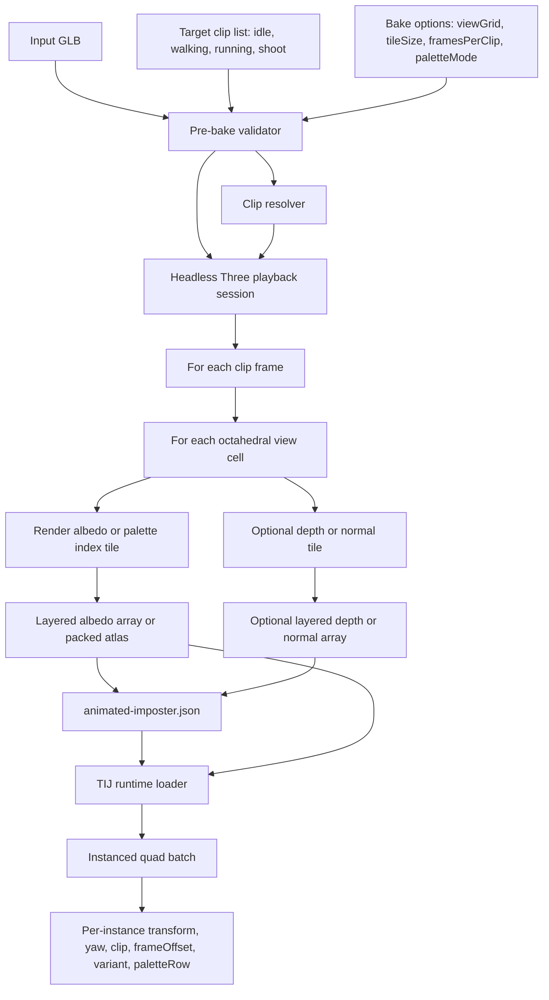

# Animated Imposter Design

Status: decision record - W1 schema/validator and W2/W3 review spike implemented.
Date: 2026-04-24.
Parent brief: [animated-imposter-brief.md](animated-imposter-brief.md).
Worklog: [animated-imposter-worklog.md](animated-imposter-worklog.md).
Cycle plan: [animated-imposter-dev-cycle.md](animated-imposter-dev-cycle.md).

Research note: the brief asked for Context7 MCP for library docs. Context7 was not exposed in this Codex session through available MCP tool discovery, so library facts below are cited to current primary docs, source repositories, and engine documentation instead.

## 1. First-Principles Framing

A TIJ soldier is roughly human height. At a 1080p viewport and a 60-70 degree vertical FOV, a 1.8 m character projects to about 7-8 px at 200 m and about 3 px at 500 m by the pinhole projection formula `pixels = viewportHeight * height / (2 * distance * tan(fov / 2))`. At 200 m, the player reads a moving biped silhouette, heading, faction color, muzzle flashes, and group flow. At 500 m, independent limb placement is mostly below the perceptual threshold unless a camera zoom or aircraft view magnifies it. Creative Assembly's Total War: Warhammer II discussion frames thousands of units as a combined LOD, CPU scheduling, and display-detail problem rather than a single render trick; Asobo's A Plague Tale: Requiem rat tech similarly layers agent detail instead of giving every distant agent full representation ([Game Developer - Total War: Warhammer II](https://www.gamedeveloper.com/design/designing-i-total-war-warhammer-ii-i-to-handle-tons-of-units-and-massive-battles), [Game Developer - A Plague Tale: Requiem](https://www.gamedeveloper.com/design/making-the-rat-tastic-sequel-a-plague-tale-requiem)).

The design implication is that TIJ needs a cheap moving silhouette for the 50-250 m band, then a static or very low-cadence horizon representation after motion stops helping readability. The first implementation should minimize runtime skeleton cost and draw calls, accept far-distance angular approximation, and prove the actual screen-space artifact before expanding to all clips and characters.

## 2. Reference List

- [sweriko/Horde](https://github.com/sweriko/Horde): public Three.js/WebGPU/TSL crowd demo using animated octahedral impostor quads, per-instance animation state, a palette texture, and a KTX2 texture array. It is the closest public reference to the target visual. It is not directly portable because the runtime is WebGPU/TSL with storage buffers and the repository notes that tooling for creating the assets will be open sourced later.
- [Horde instanced animated octahedral shader](https://github.com/sweriko/Horde/blob/main/instanced-animated-octahedral.ts) and [Horde demo wiring](https://github.com/sweriko/Horde/blob/main/demo.ts): useful for understanding the asset shape: variants, frame ranges, palette rows, view-cell selection, and per-instance offsets. The TIJ translation should copy the contract ideas, not the WebGPU compute path.
- [agargaro/octahedral-impostor](https://github.com/agargaro/octahedral-impostor): WIP Three.js/WebGL octahedral impostor implementation with TypeScript and GLSL. It is static, but it is the best public WebGL reference for octahedral view selection and billboard shader organization.
- [agargaro InstancedMesh2 docs](https://agargaro.github.io/instanced-mesh/getting-started/00-introduction/): WebGLRenderer-oriented instancing, LOD, and culling reference. This may inspire runtime batching decisions, but the first TIJ slice should use built-in `THREE.InstancedMesh` unless a measurable gap appears.
- [Babylon.js VAT PR](https://github.com/BabylonJS/Babylon.js/pull/11317), [Babylon baked animation article](https://babylonjs.medium.com/creating-thousands-of-animated-entities-in-babylon-js-ce3c439bdacf), and [Babylon baked texture docs mirror](https://docfork.com/babylonjs/documentation): public WebGL/WebGPU engine path for many animated entities using baked animation textures and thin instances. This supports the general "animation state in textures, not per-entity skeletons" direction even though the first TIJ slice is octahedral rather than mesh VAT.
- [Three.js DataArrayTexture docs](https://threejs.org/docs/pages/DataArrayTexture.html), [InstancedMesh docs](https://threejs.org/docs/pages/InstancedMesh.html), and [ShaderMaterial docs](https://threejs.org/docs/pages/ShaderMaterial.html): current Three.js APIs for raw texture arrays, instanced draw submission, and custom GLSL. These are the runtime primitives for the WebGL2 translation of Horde's asset contract.
- [Three.js Blocks VAT example](https://www.threejs-blocks.com/examples/static/webgpu_animation_texture_vertex/index.html) and [AnimationBakeMixer docs](https://www.threejs-blocks.com/docs/AnimationBakeMixer): useful Three.js baked-animation references showing how VAT/OAT frame addressing is surfaced to materials. This is not the chosen first runtime, but it is a practical fallback reference.
- [mikelyndon/r3f-webgl-vertex-animation-textures](https://github.com/mikelyndon/r3f-webgl-vertex-animation-textures): React Three Fiber/WebGL VAT example with Houdini-authored inputs. It proves the Three/WebGL shader pattern for VAT fallback and notes that lower-bit encodings are possible when storage is tight.
- [OpenVAT](https://openvat.org/) and [sharpen3d/openvat](https://github.com/sharpen3d/openvat): Blender-native VAT tooling that bakes evaluated mesh deformation to textures, stores min/max remap metadata in sidecar JSON, exports GLB/glTF proxy meshes, and documents stable-topology requirements. Useful for fallback VAT schema and validation; disqualified as a build dependency because this repo cannot launch Blender.
- [VatBaker for Unity](https://github.com/fuqunaga/VatBaker): Unity editor tool baking `AnimationClip` data from a `SkinnedMeshRenderer` into position/normal textures. It confirms the basic VAT asset contract for the fallback path.
- [Rexocrates Vertex Anim Toolset](https://github.com/Rexocrates/Vertex_Anim_Toolset) and [UE Marketplace listing](https://www.unrealengine.com/marketplace/en-US/product/vertex-anim-toolset): Unreal VAT tool reporting demos of 10,000 animated mannequins and 2,500 agents. It supports VAT as a credible fallback if octahedral angle snapping fails.
- [Godot Vertex Animation Textures Plugin](https://github.com/antzGames/Godot_Vertex_Animation_Textures_Plugin): Godot 4 plugin extending `MultiMeshInstance3D` for instanced VAT playback. Its limits - under 8192 vertices, under 8192 combined frames, no track blending - are useful guardrails for fallback validation.
- [ShaderBits octahedral impostors](https://shaderbits.com/blog/octahedral-impostors) and [Amplify Impostors manual](https://wiki.amplify.pt/index.php?title=Unity_Products:Amplify_Impostors/Manual): foundational static octahedral-impostor references. Amplify documents the close-range popping/ghosting limitations and the skinned-mesh limitation, which is why this plan treats static impostors and naive flipbooks as insufficient by themselves.
- [NVIDIA GPU Gems 3, Chapter 2 - Animated Crowd Rendering](https://developer.nvidia.com/gpugems/gpugems3/part-i-geometry/chapter-2-animated-crowd-rendering): older but still relevant evidence for GPU-instanced animated crowds with per-instance animation frames and animation data in textures. It reported about 9,547 characters at 34 fps on 2007 hardware.
- [Crowd Rendering with Per-Joint Impostors poster](https://www.cs.upc.edu/~npelechano/posterEGSR2013_Beacco.pdf): academic alternative that animates per-joint impostor parts rather than whole-character flipbooks. It reports large speedups over LOD meshes, but it is too complex for the first TIJ pass because it needs bone-part capture, masks, and articulated billboard composition.
- [GameRadar - Helldivers 2 performance comments](https://www.gamesradar.com/games/third-person-shooter/helldivers-2-wont-get-bigger-lobbies-because-16-players-would-come-with-a-side-of-16-fps-arrowhead-ceo-says-were-trying-to-fix-performance-not-kill-it/): useful negative evidence. Arrowhead's public 2025 comments frame scale as performance-constrained, but no public technical source found in this pass says Helldivers 2 uses VAT or impostors for enemies.

## 3. Ranked Recommendation

1. **E - WebGL2 animated octahedral impostor array.** This is the first implementation slice. Bake each animation frame as a full octahedral view atlas, store frames as layers in a `DataArrayTexture` where WebGL2 is available, and render soldiers as instanced quads with a custom `ShaderMaterial`. Per instance, TIJ supplies transform, yaw, clip, frame offset, variant, and palette row. The choice is inspired by Horde's public WebGPU asset/runtime shape but translated to TIJ's Three.js/WebGL runtime: no WebGPU compute, no TSL dependency, no storage buffers, no unpublished baker dependency ([sweriko/Horde](https://github.com/sweriko/Horde), [Three.js DataArrayTexture](https://threejs.org/docs/pages/DataArrayTexture.html), [Three.js InstancedMesh](https://threejs.org/docs/pages/InstancedMesh.html), [Three.js ShaderMaterial](https://threejs.org/docs/pages/ShaderMaterial.html)).
2. **B - VAT proxy LOD.** This remains the second-best fallback if view-angle snapping, texture-array portability, palette compression, or overdraw invalidates the octahedral path. VAT has better arbitrary-angle geometry and a stronger established tool ecosystem, but it pushes vertex work back onto the GPU for every proxy vertex and needs stable proxy topology. OpenVAT, VatBaker, Unreal Vertex Anim Toolset, Babylon, Godot, and GPU Gems all support VAT or baked-animation texture patterns ([OpenVAT](https://openvat.org/), [VatBaker](https://github.com/fuqunaga/VatBaker), [Vertex Anim Toolset](https://github.com/Rexocrates/Vertex_Anim_Toolset), [Babylon article](https://babylonjs.medium.com/creating-thousands-of-animated-entities-in-babylon-js-ce3c439bdacf), [GPU Gems](https://developer.nvidia.com/gpugems/gpugems3/part-i-geometry/chapter-2-animated-crowd-rendering)).
3. **C - LOD2 skinned plus static impostor.** This is the operational fallback if both baked-animation paths stall. It is simple and aligned with the existing static kiln baker, but it does not solve the 50-250 m moving-crowd readability gap.
4. **A - Naive flipbook atlas.** Reframe A as a diagnostic only: one 2D atlas stores `angle x frame x clip` tiles. This is distinct from the chosen approach. The chosen approach uses octahedral view cells inside a frame layer, can use `sampler2DArray`, and keeps per-frame addressing separate from view-cell addressing. The naive atlas is useful to prove bake/camera timing, but its storage scales along the wrong axes and it lacks the view interpolation behavior expected from octahedral impostors.
5. **D - Compressed skinned GLB all the way down.** Reject for the 3000-NPC target. Meshopt/Draco reduce transfer size, but they do not remove per-character skeleton update pressure, animation-state churn, or the runtime cost of skinning every distant actor.

This is a deliberate challenge to the original VAT-first framing. For TIJ's aircraft-distance crowd problem, whole-character animated octahedral impostors are likely a better first de-risking slice than VAT because they make runtime cost roughly "quad overdraw plus one texture lookup path" rather than "proxy vertex count times frame texture lookups". VAT should remain ready because it wins if angle snapping is visible at real TIJ distances.

## 4. Data-Flow Diagram



Inputs:

- Source GLB from the Quaternius shortlist.
- Target clip list, normally `idle`, `walking`, `running`, `shoot`, optional `death`.
- View grid, initially `6x6` or `8x8` octahedral cells.
- Tile size, initially `96` or `128` px. The first single-clip bake can use `96` to stay cheap.
- Frames per clip, initially `8-16`; first production target should test `12` frames per looping clip before assuming `16`.
- Palette mode, initially R8 palette-index albedo where possible. A raw RGBA8 path is allowed only as a debug fallback.

Outputs:

- `albedo.ktx2` or `albedo.bin`: layered frame array, where each layer is one octahedral atlas with `viewGridSide * tileSize` width and height.
- `albedo-atlas.png` or `albedo-atlas.ktx2`: packed 2D fallback for WebGL paths that cannot use texture arrays cleanly.
- `palette.png` or `palette.bin`: palette rows for faction/variant color remap. Horde uses a palette texture; TIJ should keep the concept while choosing the smallest encoding that validates.
- `depth.ktx2` / `normal.ktx2`: optional, not first slice. Depth can help soft composition and normal can help lighting, but both multiply storage and validation burden.
- `animated-imposter.json`: schema version 2 sidecar describing source, bake grid, clips, layer ranges, palette, encoding, bbox, and validation.
- Gallery artifacts: fixed camera comparison strips and a rotating preview for angle snapping review.

Runtime contract:

- TIJ loads one artifact set per character archetype.
- WebGL2 path uses `THREE.DataArrayTexture` and a `ShaderMaterial` with GLSL3 `sampler2DArray`.
- Fallback path uses one packed 2D texture atlas plus explicit frame/view UV math.
- Render path uses built-in `THREE.InstancedMesh` quads first. Add InstancedMesh2/BVH/culling only after the simplest path has measured bottlenecks.
- Per-instance attributes: `frameOffset`, `clip`, `variant`, `yaw`, `paletteRow`, and optional `lodAlpha`. Instance matrix supplies placement and scale.

## 5. Schema

The current static impostor sidecar is version 1 in [packages/core/src/kiln/imposter/schema.ts](../packages/core/src/kiln/imposter/schema.ts). Animated octahedral impostors should not overload that static schema because the artifact is a time-layered view atlas, not a single-pose atlas. Keep it in the same module family but bump the animated schema to version 2.

```ts
import { z } from 'zod';

export const ANIMATED_IMPOSTER_SCHEMA_VERSION = 2 as const;

export const AnimatedImposterMetaSchema = z.object({
  version: z.literal(ANIMATED_IMPOSTER_SCHEMA_VERSION),
  kind: z.literal('animated-octahedral-imposter'),

  source: z.object({
    path: z.string().optional(),
    bytes: z.number().int().nonnegative(),
    tris: z.number().int().nonnegative(),
    verts: z.number().int().positive(),
    skinned: z.boolean(),
    bones: z.number().int().nonnegative(),
    animationNames: z.array(z.string()),
  }),

  bake: z.object({
    baker: z.literal('three-playwright-octahedral'),
    coordinateSystem: z.object({
      forward: z.literal('+X'),
      up: z.literal('+Y'),
      right: z.literal('+Z'),
    }),
    viewGrid: z.object({
      projection: z.literal('octahedral'),
      side: z.number().int().min(2),
      cells: z.number().int().positive(),
    }),
    tileSize: z.number().int().positive(),
    framesPerClip: z.number().int().positive(),
    fps: z.number().positive(),
    transparentIndex: z.number().int().min(0).max(255).optional(),
  }),

  clips: z.array(z.object({
    target: z.enum(['idle', 'walking', 'running', 'shoot', 'death']),
    rawName: z.string().nullable(),
    resolvedName: z.string().nullable(),
    matchedBy: z.enum(['exact', 'alias', 'fallback', 'missing']),
    startLayer: z.number().int().nonnegative(),
    frameCount: z.number().int().positive(),
    fps: z.number().positive(),
    durationSec: z.number().positive(),
    loop: z.boolean(),
    fallbackFor: z.string().optional(),
  })),

  textures: z.object({
    layout: z.enum(['data-array-texture', 'packed-2d-atlas']),
    color: z.object({
      path: z.string(),
      encoding: z.enum(['r8-palette-index', 'rgba8', 'ktx2-r8', 'ktx2-rgba8']),
      bytes: z.number().int().nonnegative(),
      width: z.number().int().positive(),
      height: z.number().int().positive(),
      layers: z.number().int().positive(),
      filter: z.literal('nearest'),
      mipmaps: z.boolean(),
    }),
    palette: z.object({
      path: z.string().optional(),
      rows: z.number().int().positive(),
      columns: z.number().int().positive(),
      encoding: z.enum(['none', 'rgba8']),
    }),
    depth: z.object({
      path: z.string(),
      encoding: z.enum(['r8', 'r16f', 'none']),
      bytes: z.number().int().nonnegative(),
    }).optional(),
    normal: z.object({
      path: z.string(),
      encoding: z.enum(['oct8', 'rgba8', 'none']),
      bytes: z.number().int().nonnegative(),
    }).optional(),
  }),

  runtime: z.object({
    primitive: z.literal('instanced-quad'),
    preferredPath: z.literal('webgl2-data-array-texture'),
    fallbackPath: z.literal('packed-2d-atlas'),
    requiredAttributes: z.array(z.enum([
      'frameOffset',
      'clip',
      'variant',
      'yaw',
      'paletteRow',
      'lodAlpha',
    ])),
  }),

  bbox: z.object({
    animated: z.object({
      min: z.tuple([z.number(), z.number(), z.number()]),
      max: z.tuple([z.number(), z.number(), z.number()]),
    }),
    worldSize: z.number().positive(),
    yOffset: z.number(),
  }),

  validation: z.object({
    preBake: z.object({
      clipCoverage: z.enum(['pass', 'warn', 'fail']),
      skinWeights: z.enum(['pass', 'warn', 'fail']),
      cameraGrid: z.enum(['pass', 'warn', 'fail']),
      storageEstimate: z.enum(['pass', 'warn', 'fail']),
    }),
    postBake: z.object({
      fixedCameraSsim: z.number().min(0).max(1).optional(),
      angleSnapReview: z.enum(['pass', 'warn', 'fail', 'not-reviewed']),
      bboxPass: z.boolean(),
      transparentPixelRatio: z.number().min(0).max(1),
      warnings: z.array(z.string()),
    }),
  }),
});

export type AnimatedImposterMeta = z.infer<typeof AnimatedImposterMetaSchema>;
```

Schema choices:

- `kind: 'animated-octahedral-imposter'` distinguishes this from both the static atlas and VAT proxy fallback.
- `layout` explicitly supports `data-array-texture` and `packed-2d-atlas` because WebGL2 texture arrays are the preferred path but should not block a fallback.
- `transparentIndex` and `palette` are first-class because Horde's public asset shape demonstrates that R8 palette-index albedo is the likely storage win, while raw RGBA8 is the debug escape hatch.
- `runtime.requiredAttributes` makes the TIJ consumer contract inspectable before code touches `terror-in-the-jungle`.

## 6. Validator Design

Pre-bake validator:

- Load the GLB and verify at least one `SkinnedMesh`, a skeleton, and usable `POSITION`, `NORMAL`, `UV`, `JOINTS_0`, and `WEIGHTS_0` attributes. Three.js exposes skinned mesh support and skin-weight normalization through `SkinnedMesh` APIs ([Three.js SkinnedMesh](https://threejs.org/docs/pages/SkinnedMesh.html)).
- Verify clip coverage with [clip-resolver.ts](../packages/core/src/kiln/imposter/clip-resolver.ts), not ad hoc string matching. Missing `shoot` can warn if a declared fallback is intentional; missing locomotion should fail for the first multi-clip bake.
- Validate skin weights: each vertex should have non-negative weights, at least one non-zero influence, and a weight sum near 1.0 after normalization. This is aligned with the glTF skinning contract for `JOINTS_0` and `WEIGHTS_0` ([Khronos glTF skinning tutorial](https://github.khronos.org/glTF-Tutorials/gltfTutorial/gltfTutorial_020_Skins.html)).
- Estimate storage before rendering. Fail by default if the planned color artifact alone exceeds about 30 MiB per character in raw GPU memory. Warn if optional depth or normal layers would push the full LOD stack over the envelope.
- Verify the view grid and tile size are power-of-two friendly for packing. `6x6 * 96` gives 576 px layers, which is compact but not power of two; `8x8 * 96` gives 768 px; `6x6 * 128` gives 768 px. The first bake may accept non-power-of-two dimensions, but the sidecar must report them.
- Confirm the headless render path can produce stable alpha cutouts against a fixed background. Palette-index R8 only works if transparency and palette rows are deterministic.
- Surface source-manifest drift. The brief says all 8 ranked soldiers have `Idle`, `Run`, and at least `Walk`/`Walk_Gun`, but earlier local inspection found one manifest entry with no walk clip. The validator should treat the manifest and GLB clips as authoritative and report drift instead of trusting prose.

Post-bake validator:

- Parse `animated-imposter.json` through the public Zod schema and verify that every clip frame maps to an existing layer or packed-atlas region.
- Render a fixed-camera frame from the source skinned GLB and the animated octahedral impostor at the same clip/time/camera. Compare alpha-mask silhouette with structural SSIM target `> 0.90`; warn below threshold and fail below `0.82`. The implementation can use a small local SSIM routine over grayscale masks to avoid adding a heavy image dependency.
- Render a yaw sweep at 8 or more camera headings and flag visible view-cell popping. This is the key validator for the octahedral-first choice.
- Verify bbox and ground contact across sampled frames. Animated impostors are quads, but the sidecar still needs animated world size and y offset so TIJ can place feet consistently.
- Check palette correctness: transparent index remains transparent, palette rows do not bleed, and faction color swaps are stable under nearest filtering.
- Render a TIJ gallery preview: source GLB, animated octahedral playback, angle-sweep strip, and warnings. Human review is required before scaling to all characters because angle snapping is perceptual.

## 7. Storage Budget Table

Assumptions:

- Chosen approach stores one octahedral view atlas per animation frame.
- Layer dimensions are `viewGridSide * tileSize` by `viewGridSide * tileSize`.
- First production target should test 4 logical clips with 12 frames each, so 48 layers total.
- R8 palette-index color is 1 byte per pixel. RGBA8 debug color is 4 bytes per pixel.
- Optional depth/normal layers are excluded from the first storage target.
- Horde reference shape, from public repo inspection, is a 2048 by 2048 KTX2 texture array with 179 layers and R8-style palette indexing. That demonstrates an effective compressed download shape, but raw decoded GPU memory would be far beyond TIJ's per-character envelope if copied directly ([sweriko/Horde textures](https://github.com/sweriko/Horde/tree/main/textures)).

| Artifact mode | Formula | Per character raw | 8 characters raw |
|---|---:|---:|---:|
| Naive flipbook A, 16 angles, 8 frames/clip, 4 clips, 128 tile, RGBA8 | `16 * 8 * 4 * 128 * 128 * 4` | 32.0 MiB | 256.0 MiB |
| Naive flipbook A, same but 256 tile, RGBA8 | `16 * 8 * 4 * 256 * 256 * 4` | 128.0 MiB | 1024.0 MiB |
| Octa array, 6x6 views, 96 tile, 48 frames, R8 | `(6 * 96)^2 * 48 * 1` | 15.2 MiB | 121.5 MiB |
| Octa array, 6x6 views, 128 tile, 48 frames, R8 | `(6 * 128)^2 * 48 * 1` | 27.0 MiB | 216.0 MiB |
| Octa array, 8x8 views, 96 tile, 48 frames, R8 | `(8 * 96)^2 * 48 * 1` | 27.0 MiB | 216.0 MiB |
| Octa array, 8x8 views, 128 tile, 48 frames, R8 | `(8 * 128)^2 * 48 * 1` | 48.0 MiB | 384.0 MiB |
| Octa array debug path, 6x6 views, 96 tile, 48 frames, RGBA8 | `(6 * 96)^2 * 48 * 4` | 60.8 MiB | 486.0 MiB |
| VAT fallback, 1024 verts, 64 frames, position+normal RGBA16F | `1024 * 64 * 16` | 1.0 MiB | 8.0 MiB |

Interpretation:

- The viable octahedral target is `6x6 * 96` or `6x6 * 128` with R8 palette-index color. `8x8 * 128` is too large before optional depth, normal, source diffuse, proxy/static fallback, or KTX2 transcode overhead.
- RGBA8 is acceptable only for a debug bake or one-character visual proof.
- VAT fallback is much smaller on raw animation storage, but its runtime cost scales with proxy vertices rather than quad pixels.
- KTX2/Basis compression may make download size acceptable, but the first gate should budget decoded GPU memory, because that is what WebGL must sample.

## 8. Compatibility Table

| Area | Reuse | Touch | New |
|---|---|---|---|
| Core namespace | `kiln` public surface pattern from [packages/core/src/kiln/index.ts](../packages/core/src/kiln/index.ts) | Export animated imposter APIs from the same namespace after design validation | `kiln.bakeAnimatedImposter`, `kiln.openAnimatedImposterSession`, `AnimatedImposterMetaSchema` |
| Static imposter baker | Playwright/Three session lifecycle from [packages/core/src/kiln/imposter/bake.ts](../packages/core/src/kiln/imposter/bake.ts) | Share camera/session setup without changing static schema behavior | Animated clip/time loop plus octahedral view-grid capture |
| Clip resolver | [clip-resolver.ts](../packages/core/src/kiln/imposter/clip-resolver.ts) | Add aliases only when tests prove missing common names | No duplicate clip matcher |
| Sprite atlas/static billboard | [sprite-atlas](../packages/core/src/kiln/sprite-atlas/) and static imposter outputs | Reuse packing concepts for packed 2D fallback | Layered frame-array writer and palette-index output |
| LOD/VAT fallback | [packages/core/src/kiln/lod/](../packages/core/src/kiln/lod/) and meshopt simplification | Keep as fallback path if octahedral fails | No proxy mesh required for first octa slice |
| Gallery | [packages/server/tij-gallery/index.html](../packages/server/tij-gallery/index.html) | Add animated octahedral preview card and validation overlays | Source-vs-impostor comparison strip, angle-sweep strip |
| Pipeline runner | [scripts/run-tij-pipeline.ts](../scripts/run-tij-pipeline.ts) | Add `--only animated-imposters` or soldier substage after validation | Artifact directory contract for `animated/` outputs |
| TIJ runtime | `C:/Users/Mattm/X/games-3d/terror-in-the-jungle/src/systems/world/billboard/` consumer area from brief | Add animated impostor batch adjacent to billboard code | WebGL2 `InstancedMesh + ShaderMaterial` runtime and packed-atlas fallback |
| Dependencies | Existing Three.js, Playwright, sharp, gltf-transform, meshoptimizer | Possibly KTX2 write/transcode tooling after the R8 proof | No Blender, no 5 MB runtime library, no Horde dependency |

## 9. Risks and Unknowns

- **Angle snapping may be visible.** This is the main risk. Horde's approach is credible, and static octahedral impostors are established, but TIJ must validate animated soldiers at real camera distances and terrain backgrounds. If `6x6` or `8x8` view grids pop, switch to VAT proxy for the 50-250 m band and keep octa/static only for farther horizon LOD.
- **Overdraw can erase the quad advantage.** Instanced quads are cheap until thousands of alpha-tested soldiers overlap in forests, smoke, or formation clusters. The runtime spike must measure fill cost in a TIJ-like scene, not only in a blank demo.
- **WebGL2 texture-array support is the preferred path, not a universal guarantee.** `THREE.DataArrayTexture` is the clean contract, but TIJ still needs a packed 2D atlas fallback because the game should not hinge on one texture-array path behaving identically across all user GPUs ([Three.js DataArrayTexture](https://threejs.org/docs/pages/DataArrayTexture.html)).
- **Palette/KTX2 encoding may become the hard part.** Horde's public asset uses a compact palette-index idea, but its baker is not public yet. Pixel Forge needs to prove deterministic R8 palette generation and transparent-index handling before assuming the storage table is real.
- **Horde's tooling is not available.** The repository explicitly says asset tooling will be open sourced later, so Pixel Forge must build its own baker from the existing Three/Playwright static-impostor harness ([sweriko/Horde](https://github.com/sweriko/Horde)).
- **Lighting may look too flat.** Albedo-only impostors are probably enough at 200 m, but jungle lighting, muzzle flashes, and aircraft views may expose the lack of normal/depth. Adding normals or depth can double or triple texture storage.
- **Clip quality for NVA/VC remains a content issue.** Matt and Sam lack dedicated gun-shoot clips in the brief. The octahedral baker will faithfully bake bad melee stand-ins if source clips are wrong. The technique can proceed, but content QA must decide whether to retarget shoot clips or accept fallback silhouettes.
- **Animated impostors are not the whole crowd system.** Total War's shipped solution also uses LOD and CPU scheduling. TIJ still needs visibility bins, update throttling, animation phase variation, and distance policy for 3000 agents ([Game Developer - Total War: Warhammer II](https://www.gamedeveloper.com/design/designing-i-total-war-warhammer-ii-i-to-handle-tons-of-units-and-massive-battles)).

## 10. Implementation Plan

1. **Schema and fixtures.** Add `AnimatedImposterMetaSchema` version 2 for `animated-octahedral-imposter`, schema tests, and one tiny fixture object. No Playwright yet. Success is a validated sidecar and failing tests for missing required fields.
2. **Pre-bake validator.** Implement GLB inspection, clip resolution, skin-weight checks, view-grid storage estimates, and warnings for missing target clips. Run it against the 8-soldier shortlist and save a report, not generated assets.
3. **One-character, one-clip bake.** In the existing Playwright/Three style harness, load one GLB, resolve one locomotion clip, sample 8-16 frames, and render a `6x6` or `8x8` octahedral view grid at `96` px tiles. Write R8 palette-index color if possible; otherwise write RGBA8 debug output and mark it as over-budget.
4. **Post-bake validator.** Add schema round-trip, fixed-camera silhouette comparison, bbox/ground-contact checks, palette transparency checks, and yaw-sweep review artifacts. This is the gate before adding more clips.
5. **Small WebGL runtime spike in TIJ.** Build the smallest `InstancedMesh + ShaderMaterial` viewer with one character, one clip, and 1000-3000 instances. Use `DataArrayTexture` first and a packed 2D atlas fallback second. Measure frame time and inspect angle snapping.
6. **Gallery preview.** Extend the TIJ gallery with source GLB, animated octahedral playback, fixed comparison, angle sweep, storage numbers, and warnings. Human QA must approve the artifact before scaling.
7. **Scale to 4 clips for one character.** Add `idle`, `walking`, `running`, and `shoot` after the single-clip gate. Keep clip fallback decisions visible in the manifest.
8. **Scale to 8 characters.** Run only after one character passes visual, storage, and runtime perf gates. Keep R8 palette-index as the target; reject RGBA8 as production output unless the envelope is explicitly revised.
9. **Pipeline wiring.** Add `animated-imposters` as a resumable TIJ pipeline substage after LOD/static-impostor preparation and before gallery manifest write. Keep outputs under each soldier directory in an `animated/` subfolder.
10. **Fallback decision point.** If the octahedral path fails angle-snapping, overdraw, or texture-array constraints, pivot to the VAT proxy plan using the preserved VAT references and validator ideas in this document.
